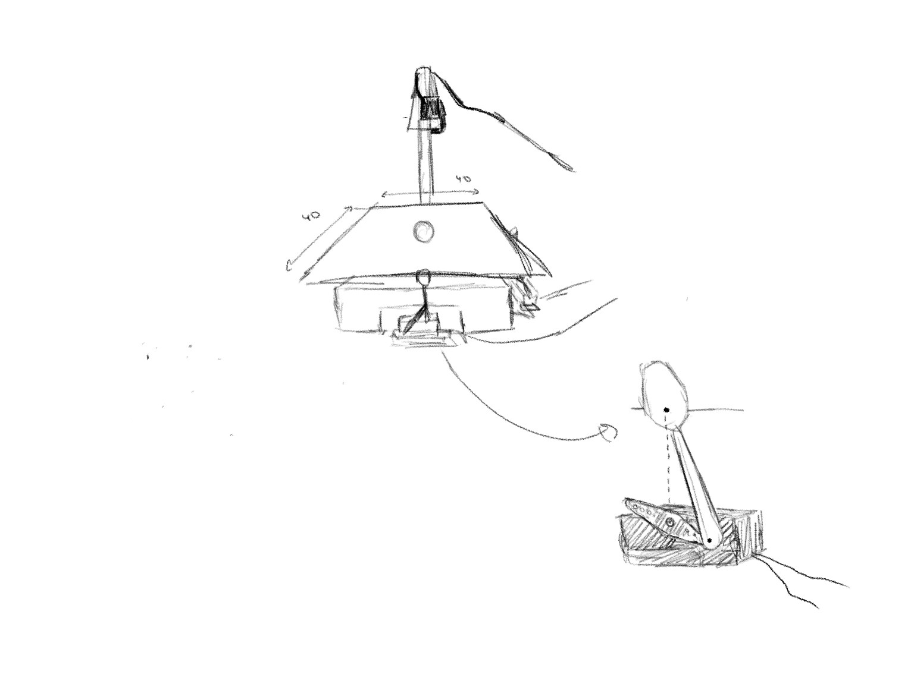
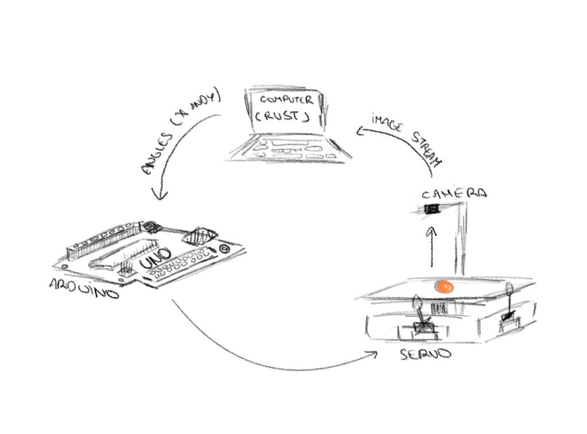

# HH-ball-plate

**HH-ball-plate** is a ball-and-plate position stabilization system designed to balance a ping-pong ball on a dynamic platform. This project was developed as part of our **Physics TFE** (Graduation Project).

The system tracks the position of the ball in real-time and adjusts the inclination of the plate using two servomotors to keep it centered.

## 👥 Project Team & Roles

* **Gilles Meunier** — *Lead Software Developer & System Designer*
  * Responsible for the entire codebase (Rust controller & Arduino firmware), architecture design, computer vision integration, and control loop engineering.

* **Victoria Douchamps** — *Project Coordinator, Structural Builder & Team Chef*
  * Managed project timelines and coordination, co-designed and assembled the physical platform structure, and kept the team energized as the official team cook.

* **Eléonore Mernier** — *Structural Designer, Diagram Artist & QA Tester*
  * Focused on the design and assembly of the physical platform, created all technical schematics and structural diagrams, and co-led the hardware testing phases.

* **Cyril Asselborn** — *Hardware Manager, Structural Designer & QA Tester*
  * Handled component procurement and hardware inventory, co-designed the mechanical structure, and co-led the system validation and experimental testing phases.

---

## 🛠️ Project Architecture

The project is split into two distinct submodules working together:

* **`controller-rust/` (The Brain):** This submodule contains the main application written in Rust. It handles the heavy lifting: receiving the ball's coordinates, calculating the regulation algorithm (PID), and making real-time decisions to counteract gravity.
* **`driver-arduino/` (The Executor):** This submodule contains the embedded firmware managed via PlatformIO for the Arduino board. Its role is strictly hardware-based: it listens for commands sent by the Rust application via serial communication and instantly applies the requested angles to the **two servomotors** (X and Y axes).

---
## 📐 Schematics & System Diagrams

This section details the physical construction and the logical data flow of the ball-and-plate system.

### 1. Platform & Mechanical Structure
This diagram illustrates the physical assembly, the pivot system supporting the plate, and how the two servomotors are mechanically linked to control the X and Y tilt axes.



### 2. System Functional Loop
The flowchart below maps out the real-time operational loop, demonstrating how data travels from the physical world into the software layer and back to the actuators.



---

## 🚀 Features
* **Active Center Stabilization:** Keeps a ping-pong ball perfectly balanced at the center of a dynamic inclined plane using real-time physics calculations.
* **Dual-Axis Control:** Independent, simultaneous, and synchronized management of the plate's X and Y axes.
* **Advanced PID Regulation:** Custom Proportional-Integral-Derivative loop optimized to minimize overshoot, handle fast physical transitions, and efficiently counteract gravity.
* **Computer Vision Tracking:** High-speed recognition of the ping-pong ball using robust HSV color filtering to maintain reliable tracking under various ambient lighting conditions.
* **Live Visualization Window:** A dedicated graphical interface displaying the live camera feed with tracking overlays, paired with real-time plots showing the target vs. actual angles of the servomotors.
* **High-Frequency Control Loop:** Low-latency pipeline ensuring that frame processing and motor adjustments happen fast enough to prevent the ball from falling.
* **Dynamic Mouse Interaction:** Real-time target control directly from the visualization window (Left-click to queue custom waypoints, Right-click and hold to force the target to follow the mouse dynamically, and Middle-click to instantly clear the queue and reset the target to the center). *(EXPERIMENTAL in branch 'develop' in `./controller-rust`)*
* **Automated Unit Testing:** Comprehensive test suites implemented in Rust to validate the core logic, data parsing, and PID algorithm behavior. *(EXPERIMENTAL in branch 'feat/tests')*
* **PID Parameter Optimizer:** An integrated optimization tool designed to fine-tune PID coefficients using an approximate simulation physics engine. *Note: The simulation engine is currently highly simplified and its results should not be fully relied upon for the real-world physical setup yet.* *(EXPERIMENTAL in branch 'feat/tests')*
* **Optimized Architecture:** Strict separation between high-performance data processing (Rust) and low-level hardware actuation (Arduino via PlatformIO).

---

## 🔧 Installation and Setup

### Prerequisites
* A working **Rust** environment (`rustup`).
* **PlatformIO** (Core or IDE extension in VS Code) to build and upload the Arduino code.
* **OpenCV** library installed on your system (required for computer vision and ball tracking).
* Potential core build tools and dependencies (e.g., `pkg-config`, `cmake`, or C++ compilers depending on your OS to compile OpenCV bindings in Rust).
* The physical components (plate, 2 servomotors, ball-tracking system/camera, Arduino board).

### Configuration & WSL Notes
1. **Environment Variables:** Before running the application, make sure to configure the environment variables in a `.env` file located inside the `controller-rust/` directory.
2. **WSL Users (Crucial):** If you are running the Rust controller inside WSL (Windows Subsystem for Linux), USB devices are not attached by default. You **must use `usbipd`** to bind and attach both hardware components to your WSL distribution:
   * Connect and attach the **camera** so the Rust controller can access the video stream.
   * Once the code is uploaded to the **Arduino**, you must also attach the Arduino via `usbipd` so the Rust controller can communicate with it over the serial port.

### Running the Project
1. Upload the code from `driver-arduino` to your Arduino board using PlatformIO.
2. Connect both the Arduino and the camera to your computer (and attach them via `usbipd` if using WSL).
3. Launch the controller application:
   ```bash
   cd controller-rust
   cargo run --release
   ```

© 2026 Cyril Asselborn, Eléonore Mernier, Victoria Douchamps, Gilles Meunier. All rights reserved.